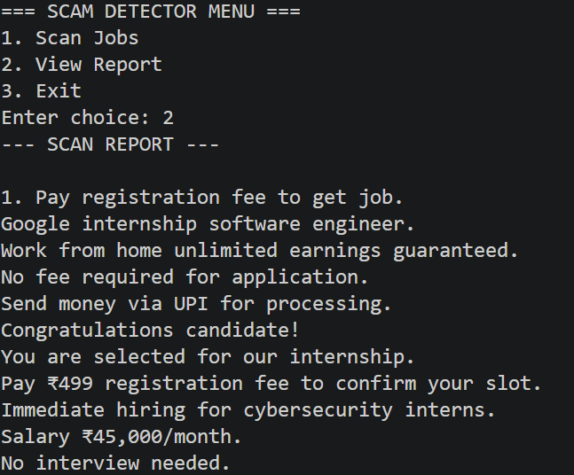
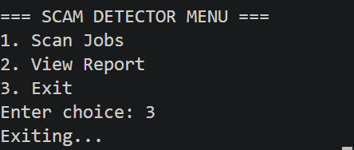
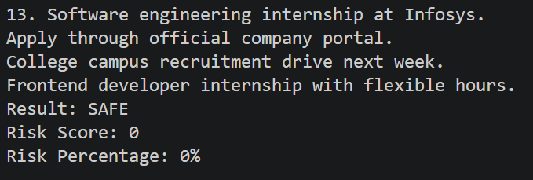
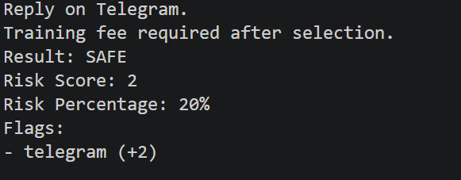
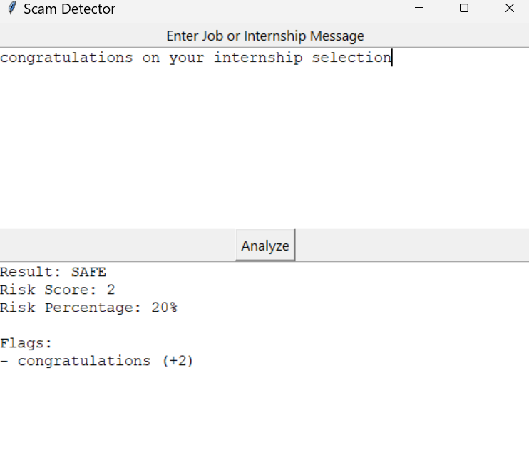

# Scam Detector Python

A Python-based cybersecurity project that detects suspicious job and internship scams using weighted keyword analysis and risk scoring.

## Features
- Scam keyword detection
- Risk score calculation
- Risk percentage system
- Paragraph-based scam analysis
- Report generation
- CLI menu system

## Technologies Used
- Python
- File Handling
- Modular Programming

## How to Run
python main.py

## Future Improvements
- Machine Learning scam classification
- Email phishing detection
- URL reputation analysis
- OCR screenshot scanning
- Web version deployment

## Screenshots

